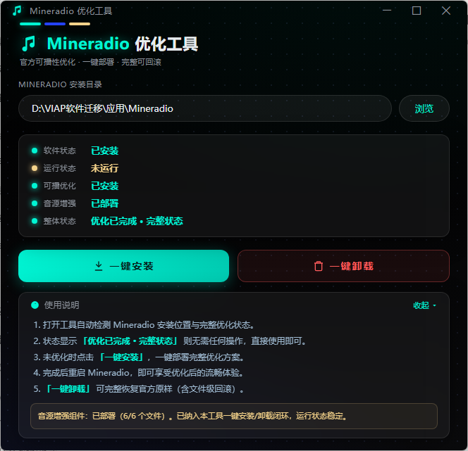

# Mineradio 优化工具

> Mineradio 官方可播性实测 + 播放链路增强 + 完整体验优化
> 一键安装 / 一键卸载 · 官方文件零改动 · 完整可回滚

---

## 项目简介

本项目为 [Mineradio](https://github.com/XxHuberrr/Mineradio)（v2.1.0）提供一套**完整的体验优化方案**，以**独立插件 + 文件级注入**的形式部署，官方文件零改动、可一键完整回滚。

核心优化方向：

- **官方可播性实测**：修正原版换源误判，官方可直接播放的歌曲保持官方源，音质与稳定性不受影响
- **播放链路增强**：预扫描 + URL 预取，消除换源实时解析延迟，实现"打开即用、点击即播"
- **多源容错**：音源自动切换 + 健康检查 + 兜底，单源失效不中断播放

配套提供 **WebView2 玻璃拟态 GUI 工具**（`MineradioTool_v4.exe`），自动检测安装位置与优化状态，一键完成安装 / 卸载。



---

## 优化总览

| 部分 | 内容 |
|------|------|
| ① 官方可播性实测 | 防"官方可播却被误换源"，官方源优先 |
| ② 播放链路增强 | 预扫描映射 + URL 预取缓存（90 分钟 TTL） |
| ③ 播放体验优化 | 多源容错 + 健康检查 + 无缝降级 |

---

## 优化内容

- **官方可播性实测**：官方可直接播放的歌曲保持官方源，不被误换，音质与稳定性更好
- **灵活多音源**：多音源自动切换 + 健康检查 + 兜底，单源失效不中断播放
- **流畅播放**：预扫描 + URL 预取缓存，消除换源实时解析延迟，点击即播
- **一键闭环**：一键安装/卸载，官方文件零改动、完整可回滚

---

## 对比原版提升

| 维度 | 原版 v2.1.0 | 优化后 |
|------|-------------|--------|
| 播放延迟 | 换源需实时解析（约 2.8s） | URL 预取缓存，点击即播 |
| 换源决策 | 按元数据标记判断，易误判 | 官方可播性实测，官方可播保持官方源 |
| 可用性 | 单源依赖，失效即断 | 多源容错 + 健康检查 + 兜底 |
| 启动恢复 | 需重新扫描 | 2s 恢复预扫描状态，增量补扫 |
| 可回滚性 | — | 一键卸载恢复官方原样 |

---

## 快速开始

1. 下载官方原版 Mineradio v2.1.0 并安装
2. 运行 `MineradioTool_v4.exe`（自动检测安装位置与优化状态）
3. 点击 **「一键安装」**，自动完成全部优化部署
4. 重启 Mineradio，即达到完整优化状态

> 工具界面 100% 复刻 Mineradio 原版视觉（深色渐变 + 点阵纹理 + 毛玻璃卡片 + 青绿发光按钮），WebView2 渲染，支持窗口拖拽与边缘缩放。

## 一键卸载

点击 **「一键卸载」**，自动恢复官方原样：

- 用官方原版文件恢复 `server.js` / `11-provider-fallback.js` / `index-loader.js`
- 删除全部注入文件
- 清理备份目录

---

## 技术细节

### 部署策略

- **官方可播插件**：仅向 `index-loader.js` 的 `modulePaths` 追加一行钩子路径，官方文件零改动
- **注入组件**：文件级替换（安装前自动备份到 `.mr-tool-backup/`，卸载优先从备份恢复）

### 文件清单

```
resources/
├── official/     # 官方原版待替换文件
├── injected/     # 注入增强版（对应文件）
└── files/        # 独立注入模块
```

### 技术栈

- Python 3.11 + pywebview（WebView2 渲染）
- Node.js VM 沙箱（音源脚本执行）
- 本地 localStorage 持久化缓存

### 工具功能（v4.1）

- 自动检测 Mineradio 安装位置与完整优化状态
- 一键安装 / 一键卸载（文件级备份恢复）
- 标题栏拖拽移动 + 四边四角窗口缩放
- 完整界面图标（标题栏 Logo / 状态指示点 / 按钮图标）
- 使用说明卡片支持内部滚动

---

## 免责声明

本项目仅供技术学习与个人使用。请尊重音乐版权，支持正版。使用本项目造成的任何后果由使用者自行承担。
